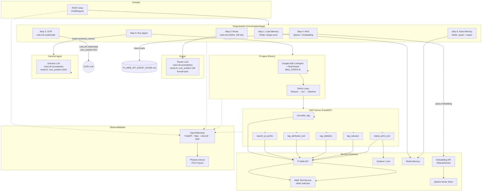

# Análise da Arquitetura do Agente

## 1. Tipo de Agente

### Classificação Geral: **Agente Híbrido Multi-estágio com Roteamento**

O sistema não é um único agente, mas uma **orquestração de 3+ agentes** em pipeline, cada um com arquitetura diferente:

| Estágio | Tipo | Framework | Estratégia |
|---------|------|-----------|------------|
| **Router** | Classificador monolítico (não-agente) | LiteLLM direto | Prompt → JSON (1 chamada LLM, sem tools) |
| **General Agent** | LLM puro (não-agente) | LiteLLM direto | Prompt → Resposta (1 chamada LLM, sem tools) |
| **PI Agent** | **ReAct** (Reason + Act) | Google ADK `LlmAgent` + `McpToolset` | Loop: raciocina → chama tool → observa → repete |
| **OCR** | Extrator (não-agente) | LiteLLM direto | Prompt com imagem → texto (1 chamada LLM, sem tools) |

### PI Agent = ReAct, não CoT

- **ReAct**: o agente **raciocina** (decide o que fazer) → **age** (chama tool MCP) → **observa** resultado → repete até ter resposta. O `Runner.run_async()` do ADK implementa exatamente este loop.
- **Não é CoT**: o system prompt explicitamente proíbe Chain-of-Thought (`"Seja direto e conciso. Responda apenas o que foi perguntado, sem explicar raciocínio."`). O agente não é instruído a "pensar passo a passo".
- **Não é planejador**: não há plano explícito gerado antes da execução. O agente decide a cada iteração qual tool chamar.

### Padrão Arquitetural Geral: **Supervisor + Subagentes Especializados**

```
Orquestrador (ConversationSaga)
  ├── Router (classifica: conversa_comum | pims)
  │     ├── conversa_comum → General Agent (LLM puro)
  │     └── pims → PI Agent (ADK ReAct + 6-8 tools MCP)
  └── Memória + OCR (pré-processamento)
```

---

## 2. Ferramentas (Tools) do Agente PI

O PI Agent utiliza **6 tools principais** + **2 opcionais**, todas expostas via **MCP Server** (`FastMCP`):

### Tools Principais (sempre ativas)

| # | Tool | Propósito | Endpoint Real | Input → Output |
|---|------|-----------|---------------|----------------|
| 1 | `consultar_tag` | Valor atual + metadados de tags | PI Web API `/batch` | tags → JSON com valor, descriptor, unidade, digital states |
| 2 | `search_pi_points` | Descoberta de tags por nome/descrição | PI Web API `/points` | query → lista de candidatos |
| 3 | `tag_attributes_tool` | Atributos de configuração (compressão, scan, etc.) | PI Web API `/points/{webId}/attributes` | tag → atributos cadastrais |
| 4 | `tag_statistics` | Estatísticas históricas (média, max, min, consumo) | PI Web API `/streams/{webId}/summary` + Math Tool `/stats` | tags + período → valor estatístico ou série temporal |
| 5 | `tag_calculus` | Integral/derivada temporal | PI Web API streams + Math Tool `/calculus` | tags + período + operação → resultado |
| 6 | `status_pims_tool` | Status operacional do PIMS | Grafana/Loki + PI Web API `/dataservers` | pergunta → veredito (EXCELENTE a OFFLINE) |

### Tools Opcionais (feature flags)

| # | Tool | Feature Flag | Propósito |
|---|------|-------------|-----------|
| 7 | `generate_test_artifact_tool` | `ENABLE_TEST_ARTIFACT_TOOL` | Geração de artefato TXT para teste |
| 8 | `export_csv_to_drive_tool` | `ENABLE_DRIVE_CSV_EXPORT_TOOL` | Exportação CSV para Google Drive |

### Cadeia de Dependência das Tools

```
PI Agent (ADK ReAct)
  └─→ McpToolset(url=settings.MCP_SERVER_URL)
        └─→ MCP Server (FastMCP, porta 8005)
              ├─→ consultar_tag()       → PI Web API / POST /batch
              ├─→ search_pi_points()    → PI Web API / GET /points
              ├─→ tag_attributes_tool() → PI Web API / GET /points/{webId}/attributes
              ├─→ tag_statistics()      → PI Web API streams + Math Tool /stats
              ├─→ tag_calculus()        → PI Web API streams + Math Tool /calculus
              ├─→ status_pims_tool()   → Grafana/Loki + PI Web API /dataservers
              ├─→ generate_test_artifact_tool() → upload API
              └─→ export_csv_to_drive_tool()    → Google Drive API
```

---

## 3. Diagrama Arquitetural



---

## 4. Fluxo Detalhado de Execução

```
POST /chat
  │
  ▼
┌─────────────────────────────────────────────────────────────┐
│ SAGA STEP 1: Load Memory                                    │
│ ▶ LLM call? NÃO                                             │
│ ▶ Redis: lrange(key, -8, -1)                                │
│ ▶ Saída: lista de turns anteriores                          │
├─────────────────────────────────────────────────────────────┤
│ SAGA STEP 2: OCR (condicional)                              │
│ ▶ LLM call? SIM (1 por imagem)                             │
│ │   LiteLLM: num_predict=512, temp=0                       │
│ │   Prompt: sistema OCR ~20 tok + imagem (base64)          │
│ │   Saída: texto extraído + tags                            │
│ ▶ Depende: imagens em ChatRequest                           │
├─────────────────────────────────────────────────────────────┤
│ SAGA STEP 3: Route                                          │
│ ▶ LLM call? SIM                                            │
│ │   LiteLLM: num_predict=128, temp=0, format=json          │
│ │   Prompt: ROUTER_PROMPT ~900 tok + mensagem               │
│ │   Saída: {"rota": "pims" | "conversa_comum"}            │
│ ▶ SEMPRE executa                                            │
├─────────────────────────────────────────────────────────────┤
│ SAGA STEP 4: RAG (condicional, só se route=pims)            │
│ ▶ LLM call? NÃO (embedding sim, LLM não)                   │
│ │   Embedding: nomic-embed-text-v2-moe ou gemini-embedding-2│
│ │   Qdrant: busca top-3 chunks + CHUNK 01 fixo             │
│ ▶ Saída: contexto RAG (~2000-4000 tokens de input futuro)  │
├─────────────────────────────────────────────────────────────┤
│ SAGA STEP 5: Run Agent                                      │
│ │                                                           │
│ ├─ Rota "conversa_comum":                                   │
│ │   ▶ LLM call? SIM (1 chamada)                            │
│ │   │   LiteLLM: num_predict=1024, temp=0                  │
│ │   │   Prompt: GENERAL_AGENT_PROMPT ~400 tok + mensagem    │
│ │   │   Tools: nenhuma                                      │
│ │   │   Saída: texto de resposta                            │
│ │                                                           │
│ └─ Rota "pims":                                             │
│     ▶ LLM call? MÚLTIPLAS (loop ReAct, até 8 iterações)   │
│     │   ADK LlmAgent:                                       │
│     │   │ System prompt: ~500 tok (agent_prompt.py)         │
│     │   │ User message: memória + OCR + RAG + pergunta     │
│     │   │   ~2000-5000 tok de input                         │
│     │   │                                                   │
│     │   Iteração 1: LLM → decide tool (input + raciocínio) │
│     │   │   output tokens: ~100-300 (raciocínio + tool call)│
│     │   │                                                   │
│     │   Iteração 2: Tool executa → resultado volta ao LLM  │
│     │   │   input tokens: anteriores + resultado tool       │
│     │   │   output tokens: ~50-200 (próximo passo)          │
│     │   │   │                                               │
│     │   │   (repete até resposta final ou MAX_STEPS=8)      │
│     │   │                                                   │
│     │   Iteração N (final): LLM → resposta final           │
│     │       output tokens: ~100-500                         │
│     │                                                       │
│     │   Total estimado por chamada PI:                      │
│     │     3-5 iterações típicas                             │
│     │     ~5000-15000 tokens de entrada (total)             │
│     │     ~500-2000 tokens de saída (total)                 │
│     │                                                       │
├─────────────────────────────────────────────────────────────┤
│ SAGA STEP 6: Save Memory                                    │
│ ▶ LLM call? NÃO                                             │
│ ▶ Redis: rpush + ltrim + expire                             │
│ ▶ SEMPRE executa (mesmo em erro)                            │
└─────────────────────────────────────────────────────────────┘
```

---

## 5. Consumo de Tokens — Análise Detalhada

### 5.1 O que Consome Tokens (por requisição /chat)

#### Chamadas LLM Obrigatórias

| Componente | Qtde | Tokens Input (estimado) | Tokens Output (config) | Frequência |
|------------|------|------------------------|------------------------|------------|
| **Router** | 1 | ~1000-1500 (prompt + mensagem) | 128 (num_predict) | 100% das reqs |
| **General Agent** | 1 | ~1500-3000 (prompt + memória + msg) | 1024 (num_predict) | ~20% das reqs |
| **PI Agent (ReAct)** | 3-8 iterações | ~1500-5000 por iteração | ~200-1024 por iteração (1024 max) | ~80% das reqs |

#### Chamadas LLM Condicionais

| Componente | Qtde | Tokens Input | Tokens Output | Frequência |
|------------|------|-------------|---------------|------------|
| **OCR** | 1 por imagem | prompt ~20 + imagem (base64, alto) | 512 (num_predict) | ~5% das reqs |

#### Chamadas Não-LLM (mas que consomem recursos)

| Componente | Tipo | Consumo | Frequência |
|------------|------|---------|------------|
| **Embedding (RAG)** | API HTTP (Ollama/Gemini) | 768-dim vector | ~80% das reqs (pims) |
| **Qdrant search** | Vector DB | busca top-3 | ~80% das reqs (pims) |
| **PI Web API calls** | HTTP | depende das tools chamadas | ~80% das reqs (pims) |
| **Math Tool calls** | HTTP | cálculo puro | ~50% das reqs (statistics/calculus) |
| **Redis** | I/O | carga/gravação de turns | 100% das reqs |
| **Observability (OTel)** | Spans | overhead leve | 100% das reqs (se ativo) |

### 5.2 Estimativa de Tokens por Chamada Típica

#### Rota: PIMS (cenário típico, 3 iterações)

```
Router:        input ~1200 + output ~50   = ~1250 tokens
RAG embedding:    ~400 tokens (embedding query)
RAG context:      ~2500 tokens de texto (injetado no prompt do agente)
PI Agent - It1: input ~3500 + output ~200 = ~3700 tokens
PI Agent - It2: input ~4000 + output ~150 = ~4150 tokens (tool call + resultado)
PI Agent - It3: input ~4200 + output ~400 = ~4600 tokens (resposta final)
Total LLM:                                   ~13700 tokens
Total embedding:                               ~400 tokens
Total (LLM + embedding):                    ~14100 tokens
```

#### Rota: Conversa Comum

```
Router:          input ~1200 + output ~50  = ~1250 tokens
General Agent:   input ~2500 + output ~300 = ~2800 tokens
Total LLM:                                  ~4050 tokens
```

### 5.3 Custos por Provedor (referência)

| Provedor | Custo Input / 1M tok | Custo Output / 1M tok | Custo por req PIMS |
|----------|---------------------|----------------------|--------------------|
| Groq (Llama Scout) | ~$0.10 | ~$0.40 | ~$0.002 |
| Gemini 2.5 Flash | ~$0.15 | ~$0.60 | ~$0.003 |
| Ollama (local) | gratuito | gratuito | apenas CPU/GPU |
| OpenAI GPT-4o-mini | ~$0.15 | ~$0.60 | ~$0.003 |

---

## 6. Análise de Eficiência e Oportunidades de Otimização

### Gargalos Identificados

| # | Gargalo | Impacto | Evidência |
|---|---------|---------|-----------|
| 1 | **ReAct loop com MAX_STEPS=8** | Cada iteração = 1 chamada LLM completa. 8 iterações = 8x o custo base. | `app/agent/agent.py:41` |
| 2 | **RAG context sempre injetado** no PIMS agent | CHUNK 01 fixo (~1000 tok) + top-3 chunks (~1500 tok) sempre enviados, mesmo quando desnecessários. | `app/clients/qdrant_client.py` |
| 3 | **Memória completa (8 turns)** sempre concatenada no prompt | Cada turn ~200-500 tok. 8 turns = ~1600-4000 tok de input. | `app/services/chat_memory_service.py` |
| 4 | **Router sempre chama LLM** mesmo para mensagens triviais | Router usa `num_predict=128`, mas o prompt ROUTER_PROMPT tem ~900 tok de input. | `app/agent/router.py` |
| 5 | **OCR envia imagem base64 inteira** para o LLM multimodal | Imagens podem ter milhares de tokens (depende do modelo). | `app/tasks/ocr_query.py` |
| 6 | **Tool result é reenviado integralmente** na próxima iteração | Resultados de tools como `tag_statistics` com `return_series=True` podem ter centenas de linhas. | `mcp_server/server.py` |
| 7 | **Loop duplicado de detecção** (search_loop_policy + repeated_tool_calls) | Duas camadas de detecção de loop pós-execução: ferramentas já foram chamadas. | `app/agent/agent.py:728-749` |
| 8 | **ADK instrumentação gera spans aninhados** | O `_TokenDedupSpanExporter` existe justamente porque cada chamada LLM do ADK gera 2-3 spans com tokens duplicados. | `app/observability/phoenix.py` |

### Oportunidades de Otimização

| # | Oportunidade | Ganho Estimado | Complexidade |
|---|-------------|----------------|--------------|
| A | **Reduzir MAX_STEPS de 8 para 5** | -37% tokens do PI Agent | Baixa |
| B | **RAG condicional: injetar apenas chunks relevantes, não sempre** | -30-50% contexto RAG | Média |
| C | **Limitar memória a 4 turns em vez de 8** | -50% tokens de memória | Baixa |
| D | **Router híbrido: heurística (regex/palavras-chave) antes do LLM** | -100% chamada router para mensagens triviais | Média |
| E | **Otimizar formato de resultado de tool: truncar séries longas** | -40-60% tokens de tool result | Média |
| F | **Prompt engineering: reduzir system prompt do agente** | -100-200 tok fixos por iteração | Baixa |
| G | **Comprimir imagem antes do OCR (resize/reduce quality)** | -50-80% tokens de imagem | Média |
| H | **Cache de resultados de ferramentas para consultas repetidas** | -100% de tools repetidas (quando aplicável) | Alta |
| I | **Desabilitar telemetria ADK nativa e usar apenas LiteLLM** | Resolve o problema de spans aninhados | Baixa |
| J | **Usar modelo mais barato (ex: Llama Scout vs Gemini)** | -50-70% custo por token | Baixa |

---

## 7. Resumo dos Padrões de Design Identificados

| Padrão | Onde | Descrição |
|--------|------|-----------|
| **Saga Pattern** | `app/application/sagas/` | 6 steps sequenciais com contexto imutável |
| **CQRS** | `app/application/commands/` + `app/application/queries/` | Separação Command/Query |
| **ReAct Pattern** | `app/agent/agent.py` (ADK LlmAgent) | Loop Reason → Act → Observe |
| **MCP (Model Context Protocol)** | `mcp_server/server.py` | Tools expostas via FastMCP remoto |
| **Function Calling** | ADK `McpToolset` | LLM decide tool calls via schema |
| **RAG (Retrieval-Augmented Generation)** | `app/clients/qdrant_client.py` | Embedding + Vector Search + Context Injection |
| **Multi-agent Orchestration** | `app/agent/orchestrator.py` + Saga | Router → subagentes especializados |
| **Adapter Pattern** | `app/agent/orchestrator.py:84-153` | _MemoryAdapter, _OcrAdapter, _RagAdapter |
| **Event Sourcing (preparação)** | `app/domain/events.py`, `app/infrastructure/event_store/` | 23 Domain Events, EventStore, EventPublisher |
| **Feature Flags** | `app/agent/agent.py`, `mcp_server/server.py` | Tools ativadas por env vars |
| **Retry + Fallback** | `app/agent/shared.py` | tenacity retry + fallback model |
| **Span Dedup** | `app/observability/phoenix.py` | _TokenDedupSpanExporter |

---

## 8. Conclusões

1. **O sistema é um meta-agente**: não há um único agente, mas um pipeline orquestrado. O router decide qual "subagente" será executado.

2. **O PI Agent é ReAct puro**, implementado via Google ADK. Não é CoT, não é planejador, não é reflexo — é o clássico loop Reason-Act-Observe com ferramentas.

3. **O maior consumidor de tokens é o PI Agent** em modo PIMS (~80% das requisições), devido ao loop ReAct que pode chegar a 8 iterações. Cada iteração = 1 chamada LLM completa.

4. **O Router é o "gatekeeper"** — barato (128 tok output) mas obrigatório. Otimizá-lo com heurísticas pré-LLM poderia eliminar 100% do custo para mensagens triviais.

5. **O RAG + memória juntos podem adicionar ~3000-6000 tokens fixos de input** antes mesmo da primeira iteração do agente — isso é contexto "gratuito" que o agente precisa processar sempre.

6. **Maior oportunidade de ganho rápido**: reduzir `MAX_AGENT_STEPS` de 8 para 5 e limitar memória a 4 turns. Ambos são mudanças de configuração, sem risco de regressão funcional.
